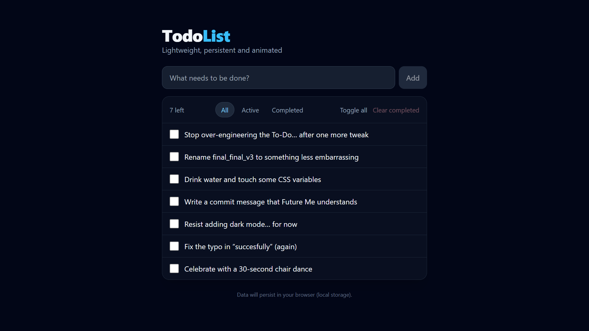

# TodoList — React + Tailwind + Framer Motion

A clean, animated to-do app with filters and local persistence.

**Live demo:** https://todo-app-bay-nu-16.vercel.app/  
**Tech:** React, Vite, Tailwind CSS, Framer Motion, localStorage



---

## Features

- Add / toggle / delete tasks  
- Filters: **All / Active / Completed**  
- **Toggle all** & **Clear completed**  
- Smooth enter/exit and layout animations (Framer Motion)  
- Accessible controls (keyboard-friendly, `aria-*`, focus-visible)  
- Polished dark UI (Tailwind)

---

## Getting Started

**Prerequisites**
- Node.js ≥ 18

**Run locally**
```bash
npm i
npm run dev
